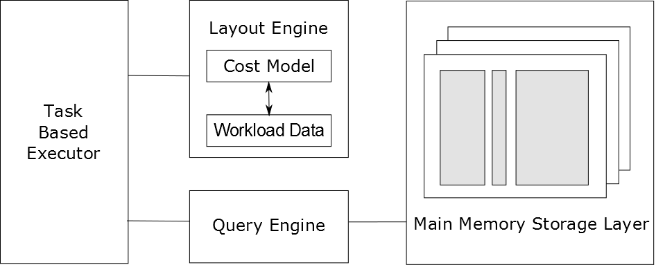
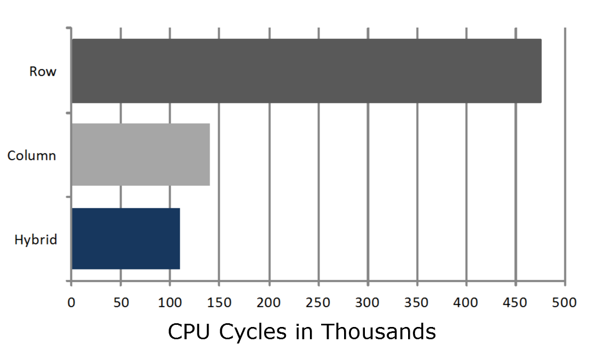

=============================
HYRISE introduction
=============================

What is HYRISE
==============

HYRISE is a Main Memory Hybrid Storage Engine, extendible prototype and research project of the group "Enterprise Platform and Integration Concepts" (EPIC) from Hasso Plattner Institute (HPI), Germany and the eXascale Infolab, research group at the University of Fribourg, in coorperation with SAP and MIT CSAIL. HYRISE expects to deliver significant performance improvement due to the possibility to vertically partition any table.

In-Memory Data Storage
----------------------

Transactional database workloads are executed in Row Stores. Typical are single tuple lookups, many modifications and simple predicate evaluation. On the other hand analytical database workloads are executed in Column Stores (Aggregation, Full Attribute Scans, Specialized Joins). With HYRISE it is possible to combine both workloads and to find the optimal storage strusture.

Hybrid Partitions
-----------------

Transactional database workloads are executed in Row Stores. Typical are single tuple lookups, many modifications and simple predicate evaluation. On the other hand analytical database workloads are executed in Column Stores (Aggregation, Full Attribute Scans, Specialized Joins). When combining both workloads, what is the optimal storage structure?

Dynamic Layouts
---------------

.. image:: _static/layout.png
    :align: right
    :width: 500px

In static layout selection the layout is chosen before application deployment. For narrow tables, finding the optimal layout is easy and can be done through exhaustive enumeration. But enterprise applications can have super-wide schemas with up to 300 attributes, this would result in billions of possible layouts. However, application workload on the database might change. So workload change may require adaptation. See also at Projects

Read more
=========

You are interested? Have a look at the :doc:`documentation/documentation`.

.. .. toctree::
..     :hidden:

..     index

.. .. toctree::
..     :maxdepth: 1

..     documentation/documentation
..     documentation/gettingstarted/index
..     documentation/architecture/index
..     documentation/queryexecution/index
..     documentation/developing/index
..     documentation/faq/index
..     documentation/proposals/index
..     doxygen/html/index