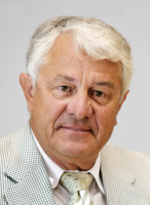
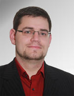
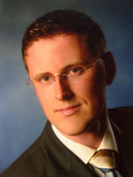
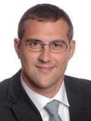
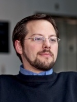
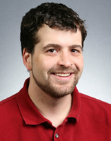

#########
People
#########

.. toctree::
   :maxdepth: 2
   
=============
Project Members
=============

`Prof. Hasso Plattner`_
=======================

Hasso-Plattner-Institut Potsdam

`Dr. Martin Grund`_
=========

University Freiburg

`Jens Krüger`_
=========

Hasso-Plattner-Institut Potsdam

`Johannes Wust`_
=========

Hasso-Plattner-Institut Potsdam

`Prof. Philippe Cudre-Mauroux`_
=========

University Freiburg

====================
past project members
====================

`Samuel Madden`_
=============

MIT CSAIL

.. _Prof. Hasso Plattner: http://epic.hpi.uni-potsdam.de/Home/HassoPlattner
.. _Dr. Martin Grund: http://epic.hpi.uni-potsdam.de/Home/MartinGrund
.. _Jens Krüger: http://epic.hpi.uni-potsdam.de/Home/JensKrueger
.. _Johannes Wust: http://epic.hpi.uni-potsdam.de/Home/JohannesWust
.. _Prof. Philippe Cudre-Mauroux: http://mcs.unibnf.ch/lecturers/philippe-cudre-mauroux
.. _Samuel Madden: http://db.lcs.mit.edu/madden/
